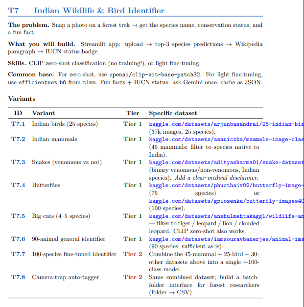

# Indian Wildlife Identifier (SMAI Assignment 3)

**Note:** This repository only contains the solution for **Task 7.5 (T7.5)**.



A zero-shot image classification application and evaluation pipeline that identifies 6 species of wildlife (cheetah, fox, hyena, lion, tiger, wolf) using OpenAI's CLIP model (`clip-vit-base-patch32`) without any fine-tuning or training required.

This repository includes:
1. A sleek **Streamlit Web Interface** for real-time inference (single image & batch camera-trap mode).
2. A **Zero-Shot Evaluation Pipeline** to calculate metrics (Top-1/Top-3 accuracy, F1-scores, confusion matrix) over the entire dataset.

## Features

- **Zero-Shot Classification:** Utilizes the vision-language capabilities of CLIP for instant wildlife classification.
- **Beautiful Streamlit UI:** A premium, dark-themed glassmorphism interface.
- **Batch Processing:** Upload multiple images at once (like a camera trap) and download the results as a CSV.
- **Rich Species Context:** Automatically provides Wikipedia summaries, IUCN conservation status badges, habitats, diets, and fun facts for the identified species.

---

## Dataset

Due to GitHub's file size limitations, the ~2GB image dataset is not included in this repository. You must download it separately from Kaggle before running the evaluation script.

**Dataset Link:** [Wildlife Animals Images (Kaggle)](https://www.kaggle.com/datasets/anshulmehtakaggl/wildlife-animals-images)

### How to set up the dataset:
1. Download the dataset archive from the Kaggle link above.
2. Extract the contents.
3. Place the extracted image folders inside a directory named `dataset/` at the root of this project.

*Note: The Streamlit app (`app.py`) works perfectly without the dataset, as it allows you to upload your own images for classification.*

---

## Installation

1. **Clone the repository:**
   ```bash
   git clone https://github.com/Vinaychaitanya001/smai_assignment3.git
   cd smai_assignment3
   ```

2. **Create a virtual environment (optional but recommended):**
   ```bash
   python -m venv venv
   source venv/bin/activate  # On Windows: venv\Scripts\activate
   ```

3. **Install the dependencies:**
   ```bash
   pip install -r requirements.txt
   ```

---

## Usage

### 1. Running the Web App
To launch the interactive wildlife identifier:
```bash
streamlit run app.py
```
This will open the app in your default web browser where you can upload photos individually or in batches to get predictions.

### 2. Running the Evaluation Pipeline
*Ensure you have downloaded and placed the Kaggle dataset in the `dataset/` folder first.*

To run the zero-shot classification on the entire dataset and generate performance metrics:
```bash
python clip_zero_shot.py
```
**Outputs generated in the `results/` folder:**
- `classification_report.txt`: Precision, recall, and F1-score for each class.
- `confusion_matrix.png`: A plotted confusion matrix of the predictions.
- `per_class_accuracy.png`: A bar chart showing the accuracy for each individual animal species.

---

## Model Details
- **Architecture:** CLIP (Contrastive Language-Image Pretraining)
- **Variant:** `openai/clip-vit-base-patch32`
- **Classes Supported:** Cheetah, Fox, Hyena, Lion, Tiger, Wolf
